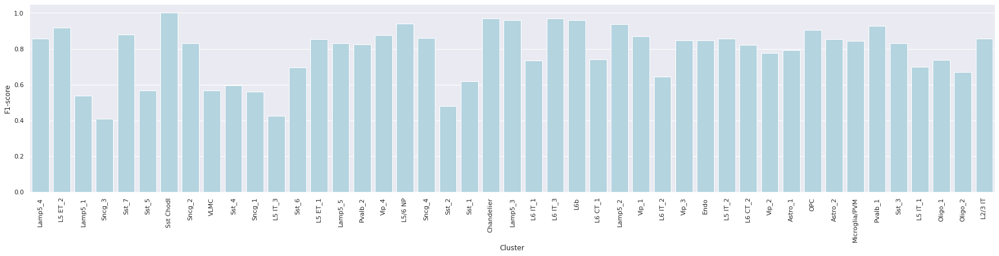
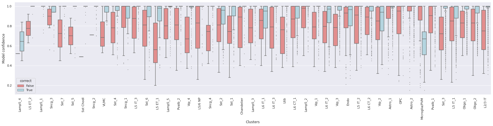

# Report card for `Correlation, Tree, and Seurat Mapping` on `Human motor cortex (Zemke et al. 2023)` benchmark

### Overview

A taxonomy was initially built using the BICCN's human motor cortex single nucleus 10x Multiome dataset. Subsequently, this same dataset was employed as the query dataset to evaluate the performances of correlation, tree, and seurat mapping algorithms.

- Summary:
    - Inputs `X` are log(CPM) normalized expression values of marker genes.
    - Hierarchy was encoded by Cluster.
 - Runtime: 0.1597 Hours
 - Version: X.Y.Z
 - Repository: [TBD](TBD)
 - Publication: --

### Metrics
 - F1-score on validation set

### Reference and query evaluation data
 - Reference
    - Mouse motor cortex taxonomy single nucleus 10xMultiome dataset.
 - Query
    - Mouse motor cortex taxonomy single nucleus 10xMultiome dataset.

### Quantitative analysis

The analysis evaluates the predictions of `correlation`, `tree`, and `Seurat` mappings in determining cluster labels for the query dataset.

Annotaion | F1-score
--- | ---
Cluster Correlation Mapping | 0.782
Cluster Tree Mapping | 0.758
Cluster Seurat Mapping | 0.981

 Cluster level metrics - Correlation mapping: 

1. Label-wise F1-score 

2. Confidence values for correctly and incorrectly assigned labels 

3. Confusion matrix (row-normalized) 

 Cluster level metrics - Tree mapping: 

1. Label-wise F1-score 

2. Confidence values for correctly and incorrectly assigned labels 

3. Confusion matrix (row-normalized) 

 Cluster level metrics - Seurat mapping: 

1. Label-wise F1-score 

2. Confidence values for correctly and incorrectly assigned labels 

3. Confusion matrix (row-normalized) 

