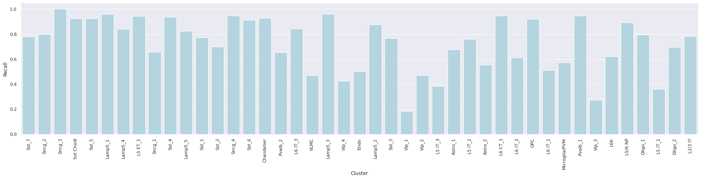

 Cluster level metrics - Correlation mapping: 

1. Label-wise F1-score 

2. Confidence values for correctly and incorrectly assigned labels 

3. Label-wise recall 

4. Label-wise precision 

5. Confusion matrix (row-normalized) 

 Cluster level metrics - Tree mapping: 

1. Label-wise F1-score 

2. Confidence values for correctly and incorrectly assigned labels 

3. Label-wise recall 

4. Label-wise precision 

5. Confusion matrix (row-normalized) 

 Cluster level metrics - Seurat mapping: 

1. Label-wise F1-score 

2. Confidence values for correctly and incorrectly assigned labels 

3. Label-wise recall 

4. Label-wise precision 

5. Confusion matrix (row-normalized) 

### Sequencing technology effect analysis

Here we evaluate `Heirarchical Correlation Mapping` at correctly predicting the Subclass label for multiple sequencing technologies.

Query | Annotation | F1-score | | Annotation | F1-score          
--- | --- | --- | --- | --- | ---                  
10X_cells_v3_AIBS | Subclass | 0.972 | | Cluster | 0.857     
10X_nuclei_v3_AIBS | Subclass | 0.943 | | Cluster | 0.785
10X_nuclei_v3_Broad | Subclass | 0.966 | | Cluster | 0.854
10X_cells_v2_AIBS | Subclass | 0.976 | | Cluster | 0.855
10X_nuclei_v2_AIBS | Subclass | 0.918 | | Cluster | 0.650
SmartSeq_cells_AIBS | Subclass | 0.971 | | Cluster | 0.812
SmartSeq_nuclei_AIBS | Subclass | 0.961 | | Cluster | 0.803

### Recommendations and caveats
 - At the **Class**, **Neighborhood**, and **Subclass** level, for high quality RNA-seq data - `Heirarchical Correlation Mapping` makes few errors.
 - `Heirarchical Correlation Mapping` mapping robustly classify samples from multiple sequencing techologies which lead to changes in gene expression.
