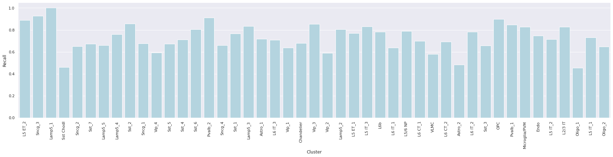

 Cluster level metrics - Correlation mapping: 

1. Label-wise F1-score 

2. Confidence values for correctly and incorrectly assigned labels 

3. Label-wise recall 

4. Label-wise precision 

5. Confusion matrix (row-normalized) 

 Cluster level metrics - Tree mapping: 

1. Label-wise F1-score 

2. Confidence values for correctly and incorrectly assigned labels 

3. Label-wise recall 

4. Label-wise precision 

5. Confusion matrix (row-normalized) 

 Cluster level metrics - Seurat mapping: 

1. Label-wise F1-score 

2. Confidence values for correctly and incorrectly assigned labels 

3. Label-wise recall 

4. Label-wise precision 

5. Confusion matrix (row-normalized) 

