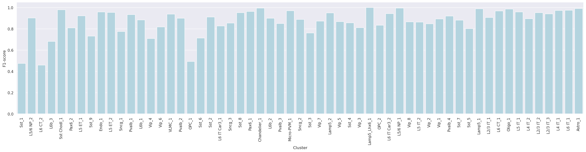
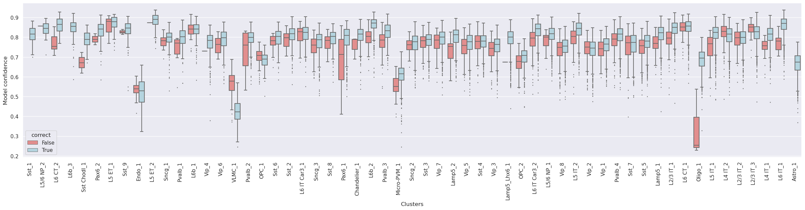
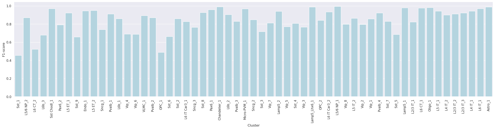
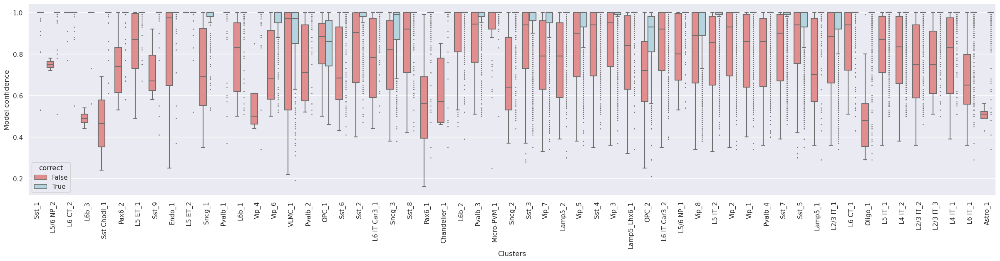
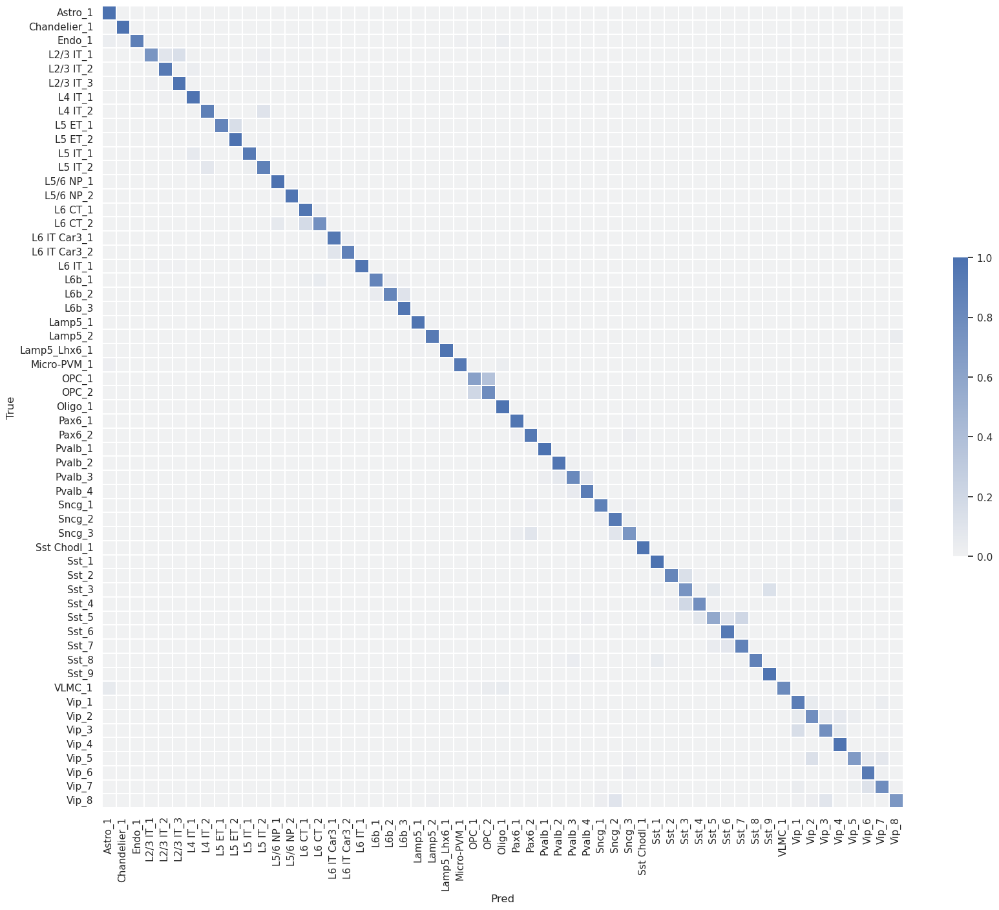
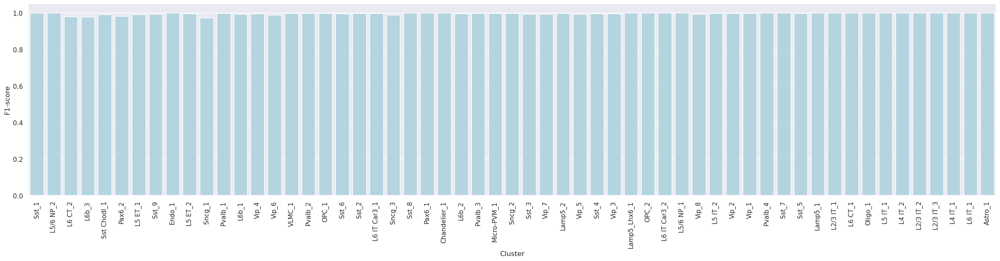
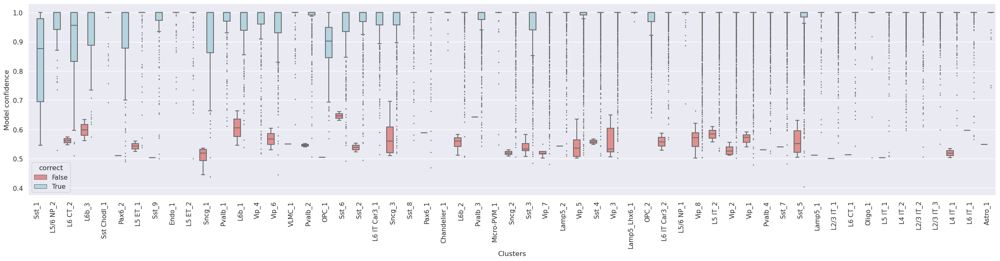
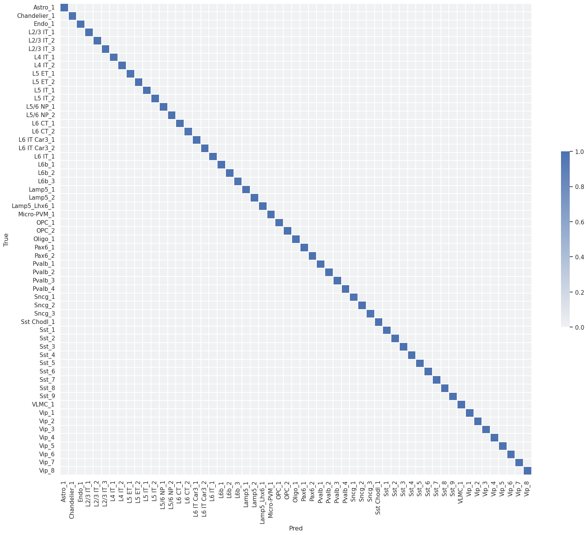

# Report card for `Correlation, Tree, and Seurat Mapping` on `Gorilla neocortex (Jorstad et al. 2023)`

### Overview

A taxonomy was initially built using the gorilla neocortex single nucleus dataset. In building the taxonomy, 1000 binary marker genes were selected based on their gene expression from the single-cell transcriptome. Subsequently, the dataset was mapped to itself, termed self-projection, for evaluating the ideal performances of correlation, tree, and seurat mapping algorithms.

### Quantitative analysis

The analysis evaluates the predictions of `correlation`, `tree`, and `Seurat` mappings in determining cluster labels in a self-projection evaluation.

Annotaion | F1-score
--- | ---
Cluster Correlation Mapping | 0.871
Cluster Tree Mapping | 0.844
Cluster Seurat Mapping | 0.996

## Correlation Mapping 

1. Label-wise F1-score 

2. Confidence values for correctly and incorrectly assigned labels 

3. Confusion matrix (row-normalized) 

## Tree Mapping 

1. Label-wise F1-score 

2. Confidence values for correctly and incorrectly assigned labels 

3. Confusion matrix (row-normalized) 

## Seurat mapping

1. Label-wise F1-score 

2. Confidence values for correctly and incorrectly assigned labels 

3. Confusion matrix (row-normalized) 

